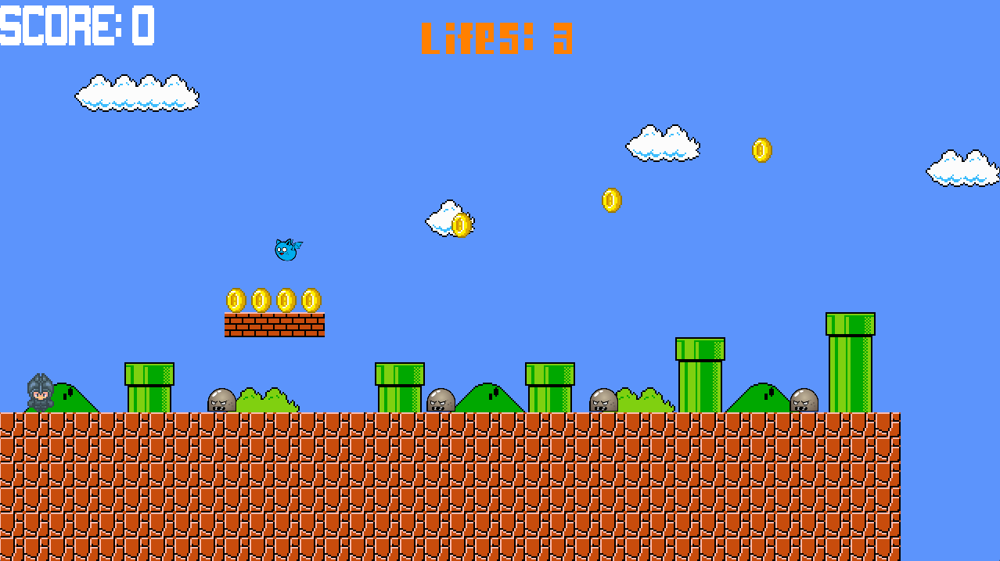
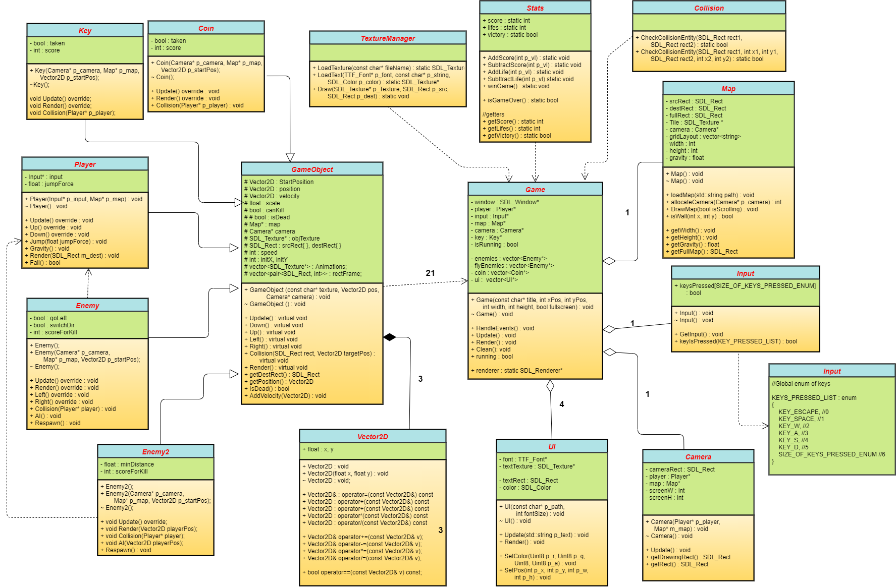

# 2D_Mario_Mock 
SuperMario-like game created with 'SDL'. 
 
 
 
 

 
# Table of contents
* [Download & Setup](#download-&-setup)
* [General info](#general-info)
* [Technologies](#technologies)

## Download & Setup  
**`DOWNLOAD THE PROJECT AND START THE SOLUTION ON x64 PLATFORM. IT WON'T RUN ON x32 UNLESS YOU SWAP THE DLLs IN THE PROJECT FOLDER`**

## General info
Simple and short 2D Platform game.  

#### How to play
**`THIS DEMO IS ONLY PLAYABLE THROUGH KEYBOARD `**  
MOVEMENT --> A & D
JUMP --> SPACEBAR
EXIT ---> ESC

#### Game architecture
The only instance present in the main is the Application. The whole game logic gets handled internally.     
All the objects present in the implementation have an Update and a draw function, that gets called in the Game class.  
The Game’s Update keeps looping all the components’ updates and then proceeds to render the objects. The map (.txt) takes care of the spawn point,and provides a grid to handle the collisions with the entities. The Player handles the Bobble’s vector direction (and its normalization), as well as its destruction and respawn.   
The Win/Lose condition is given by the number of lives that the player and the key pick up. If that number reaches 0, the game is considered over and exits the loop freeing the allocated memory, or if the key at the end of the map is picked up the player wins. 

 

 
## Technologies:
- C/C++
- SDL2
- SDL2_image-2.0.1 
- SDL2_ttf-2.0.15 
